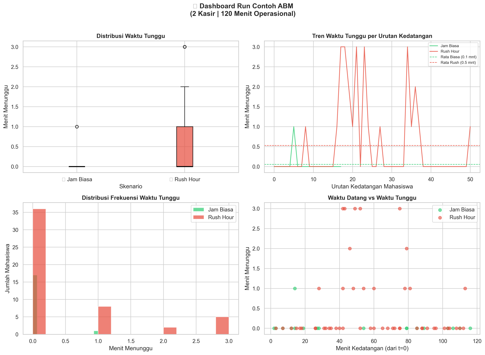
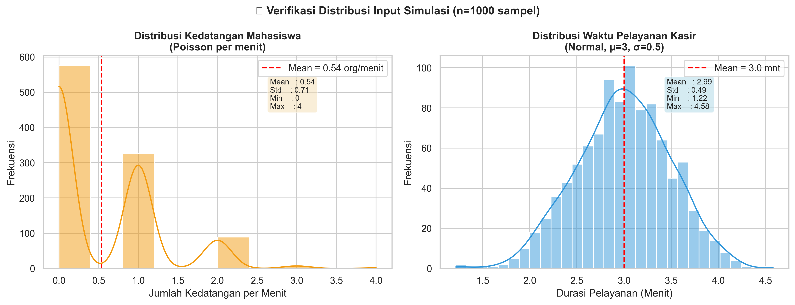
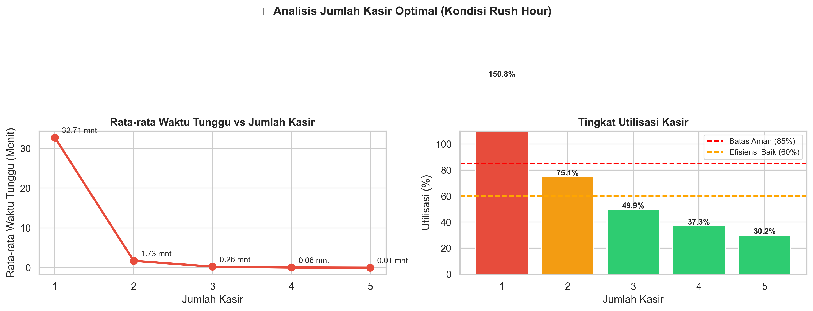

<div align="center">

# 🍱 Simulasi Antrian Kantin Kampus

### Agent-Based Modeling (ABM) & Monte Carlo Analysis untuk Evaluasi Sistem Antrian

[](https://www.python.org/)
[](https://jupyter.org/)
[](https://streamlit.io/)
[]()
[]()

**Proyek Tugas Besar — Pemodelan dan Simulasi Data**  
Semester 6 · Universitas [Nama Universitas]

[Daftar Isi](#-daftar-isi) · [Fitur](#-fitur-utama) · [Instalasi](#-instalasi) · [Menjalankan](#-cara-menjalankan) · [Hasil](#-cuplikan-hasil) · [Struktur](#-struktur-proyek)

</div>

---

## 📑 Daftar Isi

- [Tentang Proyek](#-tentang-proyek)
- [Latar Belakang](#-latar-belakang)
- [Fitur Utama](#-fitur-utama)
- [Asumsi Model](#-asumsi-model)
- [Struktur Proyek](#-struktur-proyek)
- [Instalasi](#-instalasi)
- [Cara Menjalankan](#-cara-menjalankan)
  - [Opsi 1: Google Colab ⭐](#-opsi-1-google-colab-recommended)
  - [Opsi 2: Jupyter Notebook Lokal](#-opsi-2-jupyter-notebook-lokal)
  - [Opsi 3: Dashboard Streamlit](#-opsi-3-dashboard-streamlit)
- [Input Parameter](#-input-parameter)
- [Metodologi](#-metodologi)
- [Cuplikan Hasil](#-cuplikan-hasil)
- [Teknologi yang Digunakan](#-teknologi-yang-digunakan)
- [Tim Pengembang](#-tim-pengembang)
- [Lisensi](#-lisensi)

---

## 🎯 Tentang Proyek

Proyek ini membangun **Agent-Based Model (ABM)** untuk mensimulasikan **sistem antrian di kantin kampus** dengan dua skenario: **Jam Biasa** dan **Rush Hour** (Jam Makan Siang). Simulasi dijalankan secara **time-step per menit** dan dievaluasi dengan **Monte Carlo 2000 iterasi** (1000 iterasi per skenario) untuk menghasilkan ringkasan statistik yang stabil.

Tersedia **dua antarmuka pengguna**:
1. 📓 **Jupyter Notebook** — untuk analisis mendalam dan dokumentasi lengkap
2. 🌐 **Dashboard Streamlit** — untuk eksplorasi interaktif berbasis web

> **Catatan:** Spesifikasi lengkap tugas dapat dilihat pada dokumen [`Pemodelan dan Simulasi.pdf`](./Pemodelan%20dan%20Simulasi.pdf).

---

## 📌 Latar Belakang

Kantin kampus sering mengalami **penumpukan antrian panjang** saat jam makan siang (11.30 – 13.00). Kondisi ini tidak hanya menyebabkan ketidaknyamanan mahasiswa, tetapi juga menurunkan produktivitas dan kepuasan pengguna kantin.

Simulasi ini berupaya menjawab tiga pertanyaan kunci:

| # | Pertanyaan Bisnis | Jawaban yang Dicari |
|---|---|---|
| 1️⃣ | **Berapa lama** mahasiswa harus menunggu di antrian? | Rata-rata & maksimum waktu tunggu |
| 2️⃣ | **Berapa kasir** yang ideal untuk melayani? | Jumlah kasir optimal (Elbow Analysis) |
| 3️⃣ | **Bagaimana perbedaan** performa di jam biasa vs rush hour? | Perbandingan metrik antar skenario |

---

## ✨ Fitur Utama

- 🤖 **Agent-Based Modeling (ABM)** — setiap mahasiswa dimodelkan sebagai agen individu dengan state machine (datang → antre → dilayani → selesai)
- ⏱️ **Time-step Simulation** — simulasi berjalan per menit untuk menangkap dinamika antrian secara real-time
- 🎲 **Monte Carlo 2000 Iterasi** — analisis statistik robust (1000 iterasi per skenario)
- 📊 **Dashboard Interaktif (Streamlit)** — slider parameter, visualisasi real-time, import dataset
- 📁 **Import Dataset CSV/XLSX** — gunakan data observasi nyata untuk kalibrasi parameter otomatis
- 📈 **Multi-Cashier Sweep Analysis** — analisis otomatis untuk menentukan jumlah kasir optimal (1–5 kasir)
- 💾 **Ekspor Hasil CSV** — unduh hasil Monte Carlo langsung dari dashboard
- 🎨 **Visualisasi Profesional** — boxplot, histogram, scatter plot, dan elbow chart dengan format PNG beresolusi tinggi
- 🔁 **Reproducible** — seed control untuk hasil yang konsisten

---

## 🔧 Asumsi Model

| Parameter | Nilai Default | Keterangan |
|---|:---:|---|
| **Durasi Simulasi** | `120` menit | 2 jam operasional |
| **Jumlah Kasir** | `2` kasir | Bisa dikonfigurasi (1–5 kasir) |
| **Rata-rata Pelayanan** | `3.0` menit | Waktu layanan per mahasiswa |
| **Std. Dev. Pelayanan** | `0.5` menit | Variasi alami durasi layanan |
| **Interval Kedatangan — Biasa** | `5` menit | λ = 0.20 mahasiswa/menit |
| **Interval Kedatangan — Rush** | `2` menit | λ = 0.50 mahasiswa/menit |
| **Iterasi Monte Carlo** | `1000` per skenario | Total 2000 iterasi |
| **Distribusi Kedatangan** | **Poisson** per menit | Asumsi independen & acak |
| **Distribusi Pelayanan** | **Normal** (μ=3, σ=0.5) | Dengan clipping minimum 1 menit |
| **Disiplin Antrian** | **FIFO** | First-In, First-Out |

---

## 📂 Struktur Proyek

```
Tubes-Pemodelan/
├── 📓 simulasi_antrian_kantin_kampus.ipynb  # Notebook utama (8 cell)
├── 🐍 App/
│   ├── app.py                              # Dashboard Streamlit
│   └── abm_core.py                         # Modul inti ABM & Monte Carlo
├── 📄 Pemodelan dan Simulasi.pdf           # Dokumen spesifikasi tugas
├── 📊 hasil_monte_carlo.csv                # Output 2000 iterasi Monte Carlo
├── 🖼️ dashboard_kantin.png                 # Dashboard 4-panel (run contoh)
├── 🖼️ verifikasi_distribusi.png            # Verifikasi distribusi input
├── 🖼️ analisis_kasir.png                   # Elbow chart multi-kasir
├── 📦 requirements.txt                     # Dependensi Python
└── 📘 README.md                            # Dokumentasi proyek (file ini)
```

---

## 🚀 Instalasi

### Prasyarat

Pastikan Anda telah menginstal:
- **Python 3.10+** — [Download](https://www.python.org/downloads/)
- **pip** (biasanya sudah bundled dengan Python)
- **Git** (opsional) — untuk cloning repository

### Langkah Instalasi

#### 1️⃣ Clone Repository
```bash
git clone <repository-url>
cd "Tubes Pemodelan"
```

#### 2️⃣ (Opsional) Buat Virtual Environment
```bash
# Windows (PowerShell)
python -m venv .venv
.venv\Scripts\activate

# macOS / Linux
python3 -m venv .venv
source .venv/bin/activate
```

#### 3️⃣ Install Dependensi
```bash
pip install -r requirements.txt
```

**Isi `requirements.txt`:**
```
matplotlib
numpy
pandas
openpyxl
seaborn
streamlit
```

---

## ▶️ Cara Menjalankan

Tersedia **tiga opsi** untuk menjalankan proyek ini. Pilih salah satu yang paling sesuai dengan kebutuhan Anda:

---

### ☁️ Opsi 1: Google Colab (Recommended)

> ✅ **Paling cepat & tanpa instalasi** — cukup browser dan akun Google.

#### Langkah-langkah:

1. **Login ke Google Drive** dan upload file `simulasi_antrian_kantin_kampus.ipynb` ke Drive Anda.

2. **Buka dengan Google Colab**:
   - Klik kanan file `.ipynb` → **Open with** → **Google Colaboratory**
   - Atau langsung ke [colab.research.google.com](https://colab.research.google.com/) → **Upload** tab

3. **(Opsional) Hubungkan Google Drive** jika notebook membaca/menulis file:
   ```python
   from google.colab import drive
   drive.mount('/content/drive')
   ```

4. **Jalankan Cell 1** — Cell ini akan otomatis meng-install dependensi:
   ```python
   !{sys.executable} -m pip install numpy pandas matplotlib seaborn ipython -q
   ```

5. **Jalankan semua cell** secara berurutan dari atas ke bawah:
   - Klik **Runtime** → **Run all** (atau `Ctrl+F9` / `Cmd+F9`)
   - Atau jalankan cell satu per satu dengan `Shift+Enter`

6. **Output yang dihasilkan**:
   - File CSV `hasil_monte_carlo.csv` (terbentuk otomatis)
   - Visualisasi `dashboard_kantin.png`, `verifikasi_distribusi.png`, `analisis_kasir.png`
   - Tabel ringkasan & kesimpulan otomatis di cell terakhir

#### 💡 Tips Google Colab:
- Gunakan **GPU/TPU runtime** jika diperlukan: `Runtime` → `Change runtime type`
- Simpan salinan ke Drive: **File** → **Save a copy in Drive**
- Download hasil: klik icon 📁 di sidebar kiri → kanan file → **Download**

---

### 💻 Opsi 2: Jupyter Notebook Lokal

> ✅ Cocok untuk pengembangan, debugging, dan presentasi offline.

#### Prasyarat Tambahan:
```bash
pip install jupyter notebook
```

#### Langkah-langkah:

1. **Aktifkan virtual environment** (jika dibuat saat instalasi):
   ```bash
   # Windows
   .venv\Scripts\activate
   
   # macOS / Linux
   source .venv/bin/activate
   ```

2. **Jalankan Jupyter Notebook**:
   ```bash
   jupyter notebook
   ```
   
   Browser akan otomatis terbuka di `http://localhost:8888`.

3. **Buka file** `simulasi_antrian_kantin_kampus.ipynb` dari file browser.

4. **Jalankan semua cell** dari atas ke bawah:
   - Menu **Cell** → **Run All** (atau `Ctrl+A` lalu `Ctrl+Enter`)

5. **Atau gunakan VS Code** dengan ekstensi [Jupyter](https://marketplace.visualstudio.com/items?itemName=ms-toolsai.jupyter):
   - Buka folder proyek di VS Code
   - Klik file `.ipynb` → pilih kernel Python yang sesuai
   - Klik **Run All** di toolbar atas

---

### 🌐 Opsi 3: Dashboard Streamlit

> ✅ Antarmuka web interaktif dengan slider parameter & visualisasi real-time.

#### Langkah-langkah:

1. **Pastikan dependensi sudah terinstal** (lihat [Instalasi](#-instalasi)).

2. **Jalankan Streamlit** dari root direktori proyek:
   ```bash
   streamlit run App/app.py
   ```

3. **Dashboard otomatis terbuka** di browser pada `http://localhost:8501`.

4. **Eksplorasi fitur dashboard**:
   - 🎚️ **Slider parameter** — atur jumlah kasir, durasi pelayanan, interval kedatangan
   - ▶️ **Tombol "Jalankan Simulasi"** — eksekusi ABM & Monte Carlo sesuai parameter
   - 📊 **Tab Visualisasi** — lihat boxplot, histogram, line chart, dan elbow analysis
   - 📁 **Upload Dataset** — impor file CSV/XLSX untuk kalibrasi otomatis
   - 💾 **Download CSV** — unduh hasil Monte Carlo langsung dari browser

#### 📁 Import Dataset (CSV/XLSX)

Untuk menggunakan data observasi nyata:

1. Siapkan file CSV/XLSX dengan kolom relevan (misalnya `interval_kedatangan`, `jumlah_kasir`, dll.)
2. Di dashboard, klik **"Upload Dataset"**
3. Centang **"Gunakan dataset untuk parameter"**
4. Pilih baris data dan mapping kolom ke parameter simulasi
5. Klik **"Jalankan Simulasi"**

> ℹ️ Jika nilai kolom tidak valid, dashboard otomatis fallback ke nilai default slider.

---

## 🎛️ Input Parameter

Parameter utama yang dapat dikonfigurasi:

| Parameter | Tipe | Default | Keterangan |
|---|:---:|:---:|---|
| `SIM_TIME` | `int` | `120` | Durasi simulasi (menit) |
| `JUMLAH_KASIR` | `int` | `2` | Jumlah kasir aktif (1–5) |
| `AVG_SERVICE` | `float` | `3.0` | Rata-rata durasi pelayanan (menit) |
| `STD_SERVICE` | `float` | `0.5` | Standar deviasi pelayanan (menit) |
| `INTERVAL_BIASA` | `float` | `5` | Rata-rata jeda kedatangan jam biasa (menit) |
| `INTERVAL_RUSH` | `float` | `2` | Rata-rata jeda kedatangan rush hour (menit) |
| `N_ITER` | `int` | `1000` | Jumlah iterasi Monte Carlo per skenario |

---

## 📐 Metodologi

### 1️⃣ Agent-Based Modeling (ABM)

Setiap mahasiswa diperlakukan sebagai **agen otonom** dengan state machine:

```
[MASUK KANTIN] → [CEK KASIR] → [ANTRE jika kasir sibuk] → [DILAYANI] → [SELESAI]
```

State agen:
- `arrival_time` — waktu masuk kantin
- `start_time` — waktu mulai dilayani
- `service_time` — durasi pelayanan
- `Waktu_Tunggu` = `start_time` − `arrival_time`

### 2️⃣ Time-Step Simulation

Pada setiap menit `t` (0, 1, 2, ..., 119), dilakukan 3 langkah:

1. **Generate kedatangan** mahasiswa baru: `n_datang ~ Poisson(λ)`, dengan `λ = 1 / interval`
2. **Update kasir** yang sedang melayani (kurangi sisa waktu layanan)
3. **Assign kasir kosong** ke mahasiswa pertama di antrian (FIFO)

### 3️⃣ Monte Carlo Analysis

- Setiap iterasi Monte Carlo menggunakan **seed berbeda** (reproducible)
- Dari 2000 iterasi, diekstrak **5 metrik utama**:
  - 📐 Rata-rata waktu tunggu
  - ⏱️ Waktu tunggu maksimum
  - 📊 Standar deviasi waktu tunggu
  - 👥 Total mahasiswa terlayani
  - ⚠️ Persentase mahasiswa yang harus antre

### 4️⃣ Multi-Cashier Sweep

- Simulasi diulang untuk **jumlah kasir 1, 2, 3, 4, 5**
- Menghasilkan **Elbow Chart** — titik siku menunjukkan jumlah kasir optimal
- Tambahan metrik: **utilisasi kasir** (`ΣDurasi_Layanan / (n_kasir × SIM_TIME)`)

---

## 📊 Cuplikan Hasil

### Ringkasan Statistik Monte Carlo (1000 iterasi/skenario)

| Indikator Performa | 🟢 Jam Biasa | 🔴 Rush Hour | Kenaikan |
|---|:---:|:---:|:---:|
| 🕐 Rata-rata Waktu Tunggu | `0.15` menit | `1.71` menit | **+1040%** |
| ⏱️ Waktu Tunggu Maksimum | `7.00` menit | `26.00` menit | **+271%** |
| 👥 Total Mahasiswa Terlayani | `24` | `60` | **+150%** |
| 📊 Std. Dev. Waktu Tunggu | `0.41` | `1.91` | **+366%** |
| ⚠️ % Mahasiswa Harus Antri | `9.0%` | `52.7%` | **+485%** |

### Visualisasi

| | |
|:---:|:---:|
|  |  |
| **Dashboard 4-Panel**: Boxplot, Line Chart, Histogram, Scatter | **Verifikasi Distribusi**: Poisson & Normal |
|  | |
| **Analisis Multi-Kasir**: Elbow Chart & Utilisasi | |

### 💡 Kesimpulan Utama

- 🔴 **Rush Hour** menyebabkan kenaikan waktu tunggu rata-rata hingga **10x lipat** dibanding jam biasa
- 🎯 **Jumlah kasir optimal** untuk kondisi rush hour: minimal **5 kasir** (agar utilisasi tetap ≤ 85%)
- ⚙️ **Rekomendasi**: tambah kasir aktif pada pukul 11.30 – 13.00 + implementasi pre-order system

---

## 🛠️ Teknologi yang Digunakan

| Kategori | Tools |
|---|---|
| **Bahasa Pemrograman** |  |
| **Komputasi Numerik** |  |
| **Pengolahan Data** |  |
| **Visualisasi** |   |
| **Notebook** |   |
| **Dashboard** |  |
| **File I/O** |  |

---

## 👥 Tim Pengembang

**Tugas Besar — Pemodelan dan Simulasi Data**  
Semester 6 · Tahun Ajaran 2025/2026

| Peran | Nama | Kontribusi |
|---|:---:|---|
| 👨‍💻 Pengembang | `agussusanto7` | Perancangan model ABM, Monte Carlo, dashboard Streamlit, dokumentasi |
| 🧑‍🏫 Dosen Pengampu | *(lihat RPS mata kuliah)* | Spesifikasi tugas & supervisi |

---

## 📚 Referensi

1. **Spesifikasi Tugas** — [`Pemodelan dan Simulasi.pdf`](./Pemodelan%20dan%20Simulasi.pdf)
2. **Banks, J., et al.** (2010). *Discrete-Event System Simulation* (5th Edition). Pearson.
3. **Macal, C. M., & North, M. J.** (2010). Tutorial on agent-based modeling and simulation. *Proceedings of the Winter Simulation Conference*.
4. **Streamlit Documentation** — [docs.streamlit.io](https://docs.streamlit.io/)

---

## 📜 Lisensi

Proyek ini dibuat untuk **kebutuhan akademik** dan tugas kuliah. Bebas digunakan untuk tujuan pembelajaran dengan menyertakan atribusi.

```
© 2026 — Tugas Besar Pemodelan dan Simulasi Data
Dibuat dengan ❤️ menggunakan Python, Jupyter, dan Streamlit
```

---

<div align="center">

**[⬆ Kembali ke Atas](#-simulasi-antrian-kantin-kampus)**

Dibuat dengan ❤️ · ⭐ Star repository ini jika bermanfaat!

</div>
